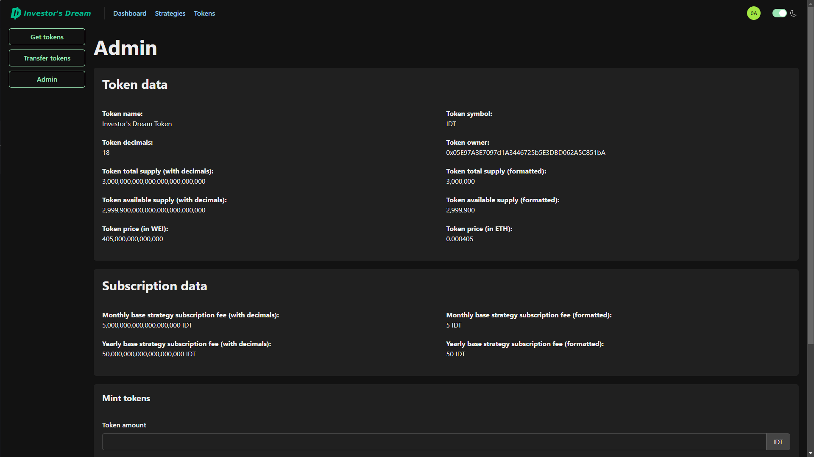
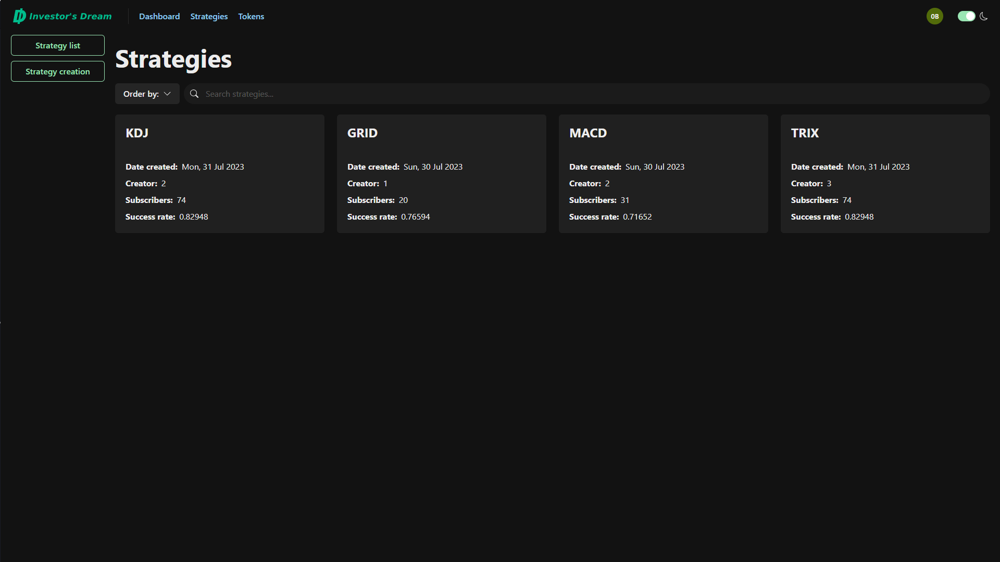
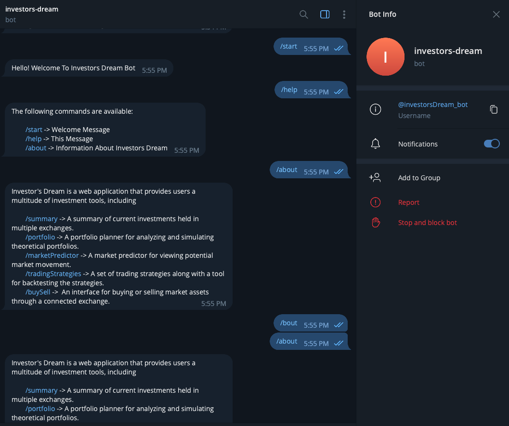
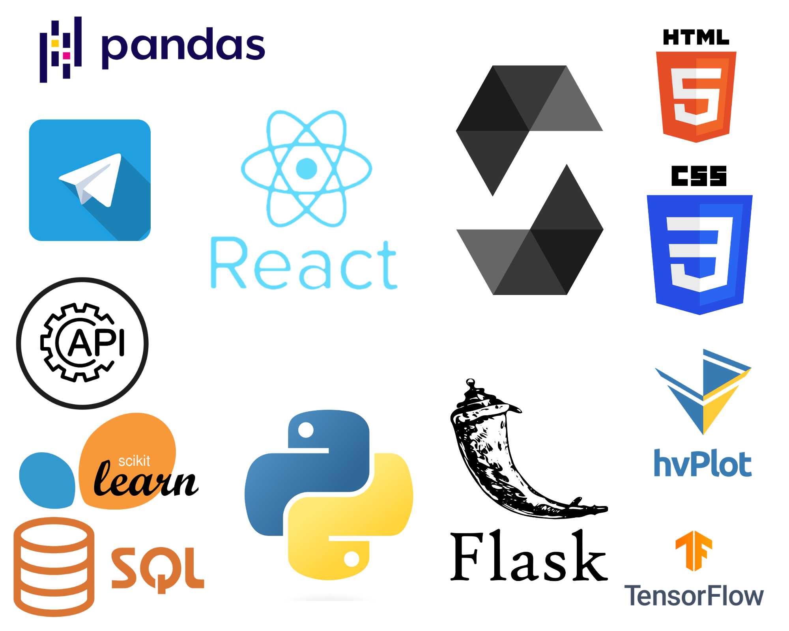

## 

A Flash/React web-application designed for

- drafting and developing custom trading strategies;
- backtesting trading strategies;
- subscribing to trading strategy notifications;
- leveraging blockchain contracts for investment purposes.

# Project details

## Description and purpose

Investor's Dream v3.0 is a web application that provides users with two primary features:

1. The ability to design and develop custom trading stategies.
2. The ability to subscribe to notifications from custom or pre-existing trading strategies on a monthly or yearly basis.

In addition to providing the means to improve a user's invesment options, the application makes it easy for new investors to begin their investment journey. The application provides metrics to judge a trading strategy's performance. By leveraging Ethereum (blockchain) smart contracts, users can purchase Investor's Dream tokens and utilize them to subscribe to trading strategy notifications.

## Questions

1. ~~How can an investor compare multiple simulated portfolios to determine their ideal investment portfolio?~~ _Answered in Project 1_
2. ~~How can an investor make the most money with the least amount of risk?~~ _Answered in Project 1_
3. ~~Which asset mix can provide the strongest portfolio given current market conditions?~~ _Answered in Project 1_
4. ~~In what ways can an investor visualize their investment planning data?~~ _Answered in Project 1_
5. ~~Who could use this application?~~ _Answered in Project 1_
6. ~~How can we diversify an investor’s portfolio such that it can be profitable and have stocks with a security worth investing in?~~ _Answered in Project 1_
7. ~~How do we present information to an investor looking to diversify their stock portfolio and maximize their profits such that they can study the information and make an informed decision before investing?~~ _Answered in Project 1_
8. ~~What are the potential returns for the user?~~ _Answered in Project 2_
9. ~~What is the user's risk tolerance?~~ _Answered in Project 2_
10. ~~How can the user be kept in the loop?~~ _Answered in Project 2_
11. How can an application draw in first-time investors?
12. How can an application monetize its features/services?
13. How can an application facilitate fee transactions for features/services?
14. How can an application deliver a product to its customers?

## Answers

### Investor's Dream token

  
Blockchain provides us a unique opportunity to create a digital asset with which users can purchase our services. By creating and minting our own Investor's Dream token (`IDT`) on the Ethereum network, we provide users a value-added asset (with the potential to be traded on digital exchanges) they can use to subscribe to trading strategy notifications. Users can purchase our tokens directly through our site by exchanging their own Ether (`ETH`). Users can also transfer the token to and from other digital wallets.

### Trading strategies

  
The trading strategy module offers users a selection of pre-existing and user-developed trading strategies, complete with performance metrics and the ability to backtest a strategy on an asset of the user's choosing. At present, the application offers users four algorithmic trading strategies:

- GRID
  - GRID trading strategy is a systematic trading approach that involves placing buy and sell orders at predetermined price levels in a grid-like pattern, aiming to profit from price fluctuations within a specific range. The GRID strategy offers users a tool for arbitrage trading based on following the stock price, aiming to achieve higher returns than simply buying and holding a stock while reducing volatility risk.
- KDJ
  - The KDJ strategy is a technical analysis tool used in financial markets to identify potential trend reversals and momentum in asset prices. It is based on the KDJ indicator, which is derived from the stochastic oscillator, a popular momentum indicator. The KDJ strategy generates signals based on the following conditions:
    - Overbought and Oversold Conditions\
      When the %K line crosses above 80, it indicates that the asset is overbought, suggesting a potential sell signal. When the %K line crosses below 20, it indicates that the asset is oversold, suggesting a potential buy signal.
    - Divergence\
      Similar to other oscillators, divergence between the KDJ lines and the price movement can indicate potential trend reversals.
    - Signal Line Crossovers\
      When the %K line crosses above the %D line, it generates a bullish signal, suggesting a potential buy signal. When the %K line crosses below the %D line, it generates a bearish signal, suggesting a potential sell signal.
- MACD
  - MACD (Moving Average Convergence Divergence) strategy is an algorithmic trading strategy used in technical analysis to identify potential trends and momentum in financial instruments, particularly in stock trading. The main signals generated by the MACD strategy are:
    - Crossovers\
      When the MACD line crosses above the signal line, it indicates a bullish signal, suggesting a potential buy signal.
    - Divergence\
      When the MACD line diverges from the price movement, it suggests a potential trend reversal or continuation.
- TRIX
  - The Trix (Triple Exponential Moving Average) strategy is based on the Triple Exponential Moving Average indicator, which is designed to filter out market noise and highlight significant price movements. The main signals generated by the Trix strategy are:
    - Bullish Signal Line Crossovers\
      When the Trix line crosses above its Signal Line, it generates a bullish signal, suggesting a potential buy signal.
    - Bearish Signal Line Crossovers\
      When the Trix line crosses below its Signal Line, it generates a bearish signal, suggesting a potential sell signal.
    - Divergence\
      Similar to other oscillators, divergence between the Trix line and the price movement can indicate potential trend reversals.

Upon backtesting a strategy, the application outputs a variety of evaluation metrics, including

- signal evaluation
  - entry and exit signals relative to the daily closing price
- trade evaluation
  - the strategy's cumulative returns over a given period
- portfolio evaluation
  - annualized return
  - cumulative returns
  - Sharpe ratio
  - Sortino ratio
  - success ratio

The module describes and optimizes these trading strategies using the Python language, visualizes them through various charts, and generates buy and sell signals; all to provide users with a better understanding of each strategy's methodology and accuracy. Users are also provided backtesting functionality to assess the profitability and risk level of different asset-strategy combinations, enabling them to choose their preferred trading strategy for a particular asset.

### Social notifications

  
Python's adaptability and integration of libraries and APIs make it a powerful tool to streamline and enhance message delivery across various platforms, ensuring efficient and effective communication. At present, the application's notification module incorporates the following messaging platforms:

- Email\
  Email communication is automated using Python's email.message and smtplib libraries. Tailored messages are sent automatically to clients' inboxes, ensuring essential notifications and updates of trading signals reach their destination promptly.
- Telegram\
  Telegram seamlessly integrates with Python using the requests library. Custom bots deliver information and engage users, enhancing our communication strategy within the Telegram ecosystem.
- Discord\
  The Discord server interacts with Python via the discordwebhook library. The API provides automated notifications, content sharing, and community engagement through webhook-based messages to make our Discord communication dynamic.
- Facebook Messenger, SMS and WhatsApp\
  Twilio provides an API for Python to send messages and notifications via Facebook Messenger, SMS and WhatsApp. Python's flexibility, combined with Twilio's capabilities ensures our messages reach our clients on their preferred messaging platforms.
- Telegram Bot\
  Telegram bots are developed using Python's telegram.ext library. Intelligent bots respond to commands, offer information, and facilitate interactions, expanding the possibilities of engagement on Telegram.

### Further information

For further information, please refer to our PowerPoint presentations for [project 3](miscellaneous/Investor's%20Dream%202.0%20FinTech%20Project%203.pptx), [project 2](miscellaneous/Investor's%20Dream%202.0%20FinTech%20Project%202.pptx) and [project 1](miscellaneous/Investor's%20Dream%201.0%20FinTech%20Project%201.pptx).

## Running the application

Version 3 of the application requires the use of a localhost Flask server for the backend, a localhost Node.js server for the frontend, all documents within this repository, the necessary API credentials, and a PostgreSQL database designed according to [our schema](miscellaneous/database_schema.svg).

Version 2 of the application can still be found at the following url:
https://github.com/julianritchey/project-2

Version 1 of the application can still be found at the following url:
https://github.com/julianritchey/project-1

## Application walkthrough

Please refer to our [project walkthrough](project_walkthrough.md) for detailed instructions on how to use the application.

## Data conclusions

Investor's Dream facilitate investments through strategy development and implementation via manual and algorithmic trading and smart contracts.

## Resources and technology employed (tech stack)

- [APIs](https://www.ibm.com/topics/api)
  - [Alpaca](https://alpaca.markets/)
  - [Telegram](https://telegram.org/)
- [CSS](https://drafts.csswg.org/)
- [HTML](https://html.spec.whatwg.org/)
- [JavaScript](https://www.javascript.com/)
  - [Axios](https://axios-http.com/)
  - [ethers](https://ethers.org/)
  - [React](https://react.dev/)
    - [Chakra UI](https://chakra-ui.com/)
    - [Chakra UI Markdown Renderer](https://github.com/mustaphaturhan/chakra-ui-markdown-renderer)
    - [React Hook Form](https://www.react-hook-form.com/)
    - [React Icons](https://github.com/react-icons/react-icons#readme)
    - [React Plotly.js](https://plotly.com/javascript/react/)
    - [React Router](https://github.com/remix-run/react-router)
    - [react-markdown](https://github.com/remarkjs/react-markdown#readme)
    - [react-moment](https://github.com/headzoo/react-moment)
    - [web3-react](https://github.com/Uniswap/web3-react#readme)
  - [Moment.js](https://momentjs.com/)
  - [ms](https://github.com/vercel/ms)
  - [TanStack Query](https://tanstack.com/query/latest)
  - [TypeScript](https://www.typescriptlang.org/)
    - [Viem](https://viem.sh/)
    - [Zod](https://zod.dev/)
  - [wagmi](https://wagmi.sh/)
  - [Web3.js](https://github.com/web3/web3.js#readme)
  - [Zustand](https://github.com/pmndrs/zustand)
- [Python](https://www.python.org/)
  - [alpaca-py](https://github.com/alpacahq/alpaca-py)
  - [datetime](https://docs.python.org/3/library/datetime.html)
  - [discord.py](https://github.com/Rapptz/discord.py)
  - [discordwebhook](https://github.com/10mohi6/discord-webhook-python)
  - [email.message](https://docs.python.org/3/library/email.message.html)
  - [Flask](https://flask.palletsprojects.com/)
  - [Flask-CORS](https://github.com/corydolphin/flask-cors)
  - [ipynb](https://github.com/ipython/ipynb)
  - [Matplotlib](https://matplotlib.org/)
  - [NumPy](https://numpy.org/)
  - [os](https://docs.python.org/3/library/os.html)
  - [pandas](https://pandas.pydata.org/)
  - [python-dotenv](https://github.com/theskumar/python-dotenv)
  - [python-telegram-bot](https://python-telegram-bot.org/)
  - [smtplib](https://docs.python.org/3/library/smtplib.html)
  - [SQLAlchemy](https://www.sqlalchemy.org/)
  - [TA-Lib](https://github.com/ta-lib/ta-lib-python)
  - [twilio-python](https://github.com/twilio/twilio-python/)
  - [uuid](https://docs.python.org/3/library/uuid.html)
  - [websocket-client](https://github.com/websocket-client/websocket-client)
  - [yfinance](https://github.com/ranaroussi/yfinance)
- [SQL](https://www.iso.org/standard/63555.html)
  - [PostgreSQL](https://www.postgresql.org/)

## Developers

- [Andrea Delgadillo Tomasevich](https://github.com/visionaryspirit)
- [Dmitry Chalganov](https://github.com/Imbadimasa)
- [John Yin](https://github.com/Ziqiangyin)
- [Julian Ritchey](https://github.com/julianritchey)
- [Wanlin Li](https://github.com/WanlinLi2021)

### _Make your dream a reality._
