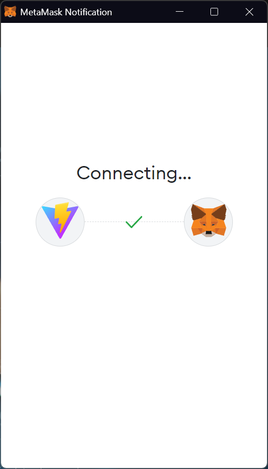
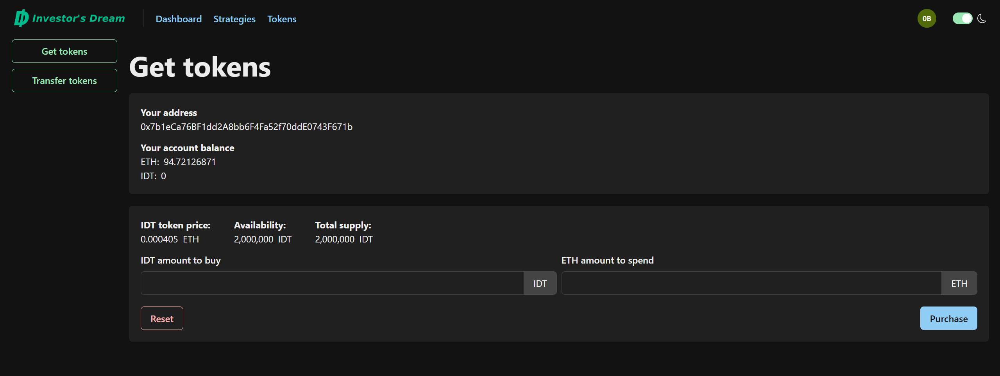
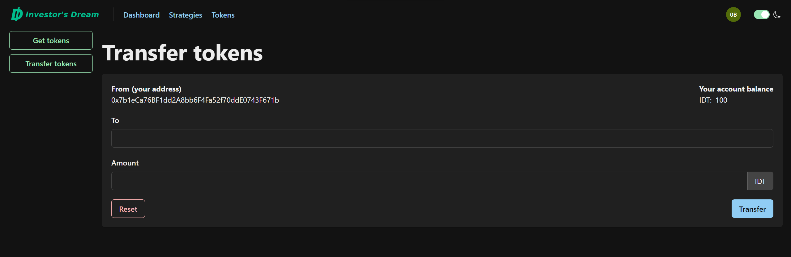
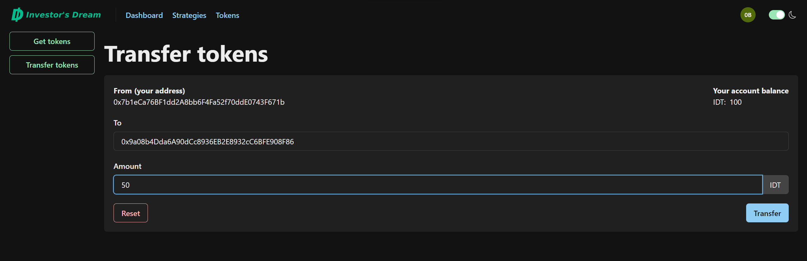
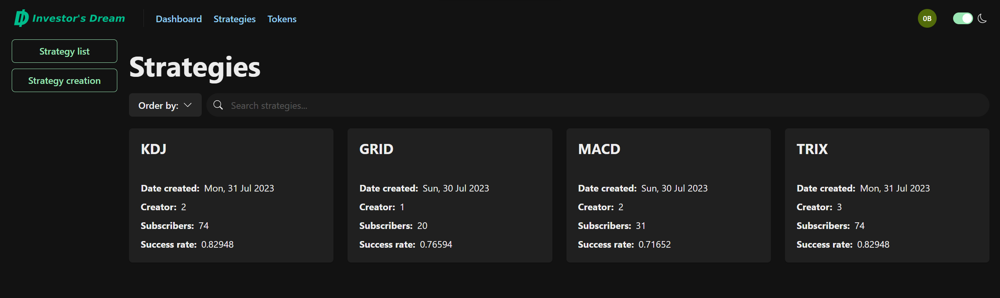
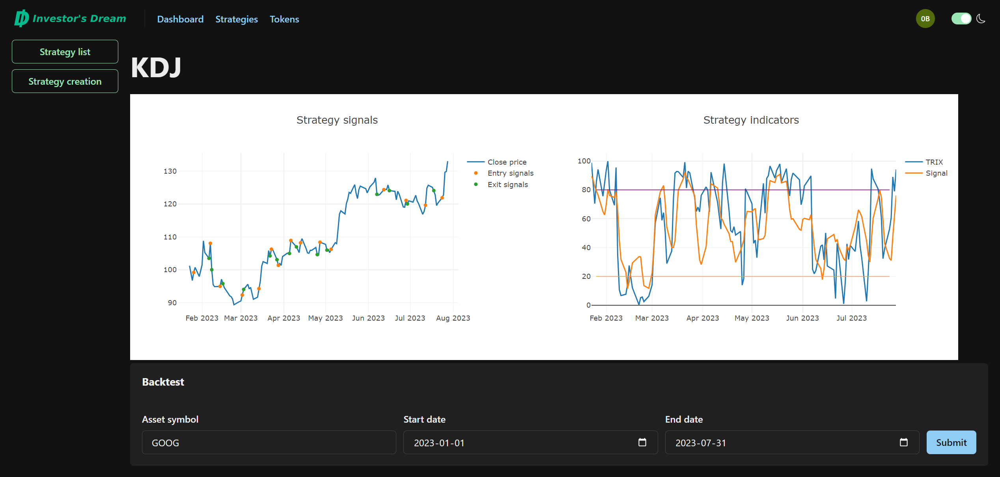
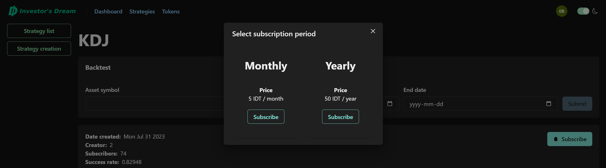
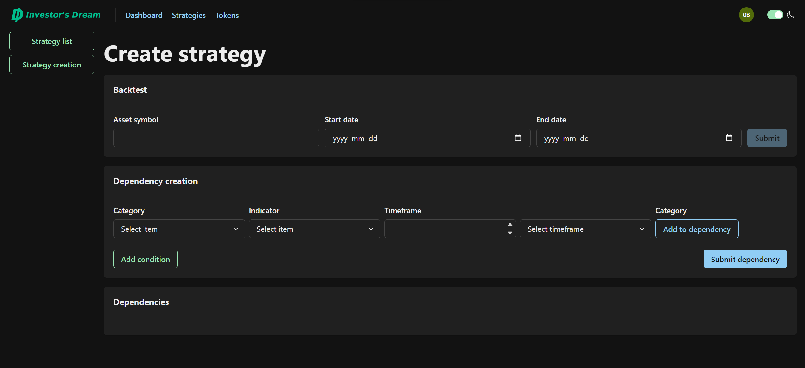

# Project walkthrough

Details for application usage.

## Getting started

  
The home page of the application provides users a `Connect` button in the top-right corner of the screen. Connecting to the site for the first time automatically generates a user profile in the application's database.

## Connecting a wallet

  
Upon clicking the `Connect` button, users are provided a modal with options for which wallet provider they would like to connect with.

|  |  |  |
| -------------------------------------------------------------------- | -------------------------------------------------------------------- | -------------------------------------------------------------------- |

Once a user has selected their provider of choice, they will be presented the appropriate connection modals from their provider.

## Home page - connected

  
After connecting their wallet, users are provided navigation links on the left-hand side of the navbar. Links include:

- `Dashbaord`
- `Strategies`
- `Tokens`

## Wallet information

  
On the right-hand side of the navbar, connected users can find their avatar. Upon clicking their avatar, users are provided a modal that displays an abbreviation of their connected wallet, their wallet balances of ETH and IDT, and links to the account settings page (undeveloped) and to disconnect.

## Dashboard page

  
The `Dashboard` link in the navbar takes users to the _Dashboard_ page (undeveloped) where they are currently provided a simple welcome card.

## Get tokens page

  
The `Tokens` link in the navbar takes users to the _Get tokens_ page where they are provided a wallet information card and a token purchase card. In the _Tokens_ sidebar, users can find two page links:

- `Get tokens`
- `Transfer tokens`

### Token purchase

  
The token purchase card on the _Get tokens_ page provides users information regarding the current price of IDT in ETH, as well as the total supply and remaining quantity available for sale. The token purchase form allows users to enter either an amount of IDT they wish to purchase or an amount of ETH they wish spend; the other will automatically calculate accordingly.

|  |  |
| -------------------------------------------------------------- | -------------------------------------------------------------- |

Upon clicking the `Purchase` button at the bottom of the form and confirming the transaction in the modal displayed by their wallet provider, users can see their updated wallet balance in the wallet information card.

## Transfer tokens page

  
The `Transfer tokens` link in the _Tokens_ sidebar takes users to the _Transfer tokens_ page where they are provided a token transfer card.

### Token transfer

  
The token transfer card on the _Get tokens_ page provides users their appropriate wallet information and a token transfer form. The token transfer form allows users to enter the wallet address they wish to send IDT to, and the amount of IDT they wish send.

|  |  |
| -------------------------------------------------------------- | -------------------------------------------------------------- |

Upon clicking the `Transfer` button at the bottom of the form and confirming the transaction in the modal displayed by their wallet provider, users can see their updated wallet balance in the token transfer card.

## Strategies list page

  
The `Strategies` link in the navbar takes users to the _Strategies list_ page where they are provided a card grid containing a variety of trading strategies, an filters to apply to the grid. In the _Strategies_ sidebar, users can find two page links:

- `Strategies list`
- `Strategy creation`

At this time, the application provides users four (4) trading strategies to choose from:

- `GRID`
- `KDJ`
- `MACD`
- `TRIX`

### Strategy details subpage

  
Upon selecting a strategy in the _Strategies list_ page, users are taken to a _Strategy details_ subpage. The subpage provides users a strategy backtest card and a strategy details card.

#### Strategy backtest

  
The strategy backtest card on the _Strategy details_ subpage provides users a strategy backtest form. The strategy backtest form allows users to enter an asset symbol, a start date and an end date.

  
Upon clicking the `Submit` button in the strategy backtest form, our server will run the appropriate calculations and result in the following:

- Two plots:
  - A plot containing closing prices for the selected period and all determined buy and sell signals;
  - A plot containing the strategy indicators that were used to determine the buy and sell signals.
- Evaluation criteria:
  - Signal evaluation
  - Trade evaluation
  - Portfolio evaluation two plots are displayed for the user:

### Strategy subscription

  
To subscribe to a strategy, users can click the `Subscribe` button in the strategy details card of the _Strategy details_ subpage. Upon clicking the `Subscribe` button, a modal is displayed that provides users two options:

- Monthly subscription
- Yearly subscription

Users can select the option of their choosing by clicking the appropriate `Subscribe` button.

After a user has clicked the `Subscribe` button for their desired subscription plan, a transacation confirmation modal is displayed by the user' wallet provider.

Upon confirming the transaction, users will see a `Subscribed` notice in the strategy details card of the _Strategy details_ subpage, along with an `Unsubscribe` button that users can click to unsubscribe from the assoicated trading strategy.

## Strategy creation page

  
The `Strategy creation` link in the _Strategies_ sidebar takes users to the _Strategy creation_ page where they are provided a strategy backtest card, a dependency creation card, and a dependencies card. For details on the strategy backtest card, see the [strategy backtest](https://github.com/julianritchey/project-3/project_walkthrough.mb#strategy-backtest) section.

### Strategy creation

## Admin page

## Logging out

  
For the privacy of personal information, users are encouraged to disconnect their wallet when not using the application. Users can disconnect by clicking the `Disconnect` link provided in the avatar modal.
